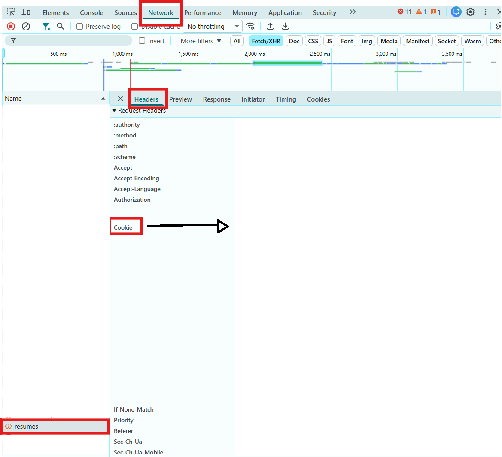

# Resume.io Browser PDF Exporter

Generate high-resolution PDFs from Resume.io preview pages, including multi-page resumes.

This project builds on the original `felipeall/resumeio-to-pdf` idea, but the main workflow now uses authenticated browser rendering instead of relying only on Resume.io preview image endpoints. That matters because the preview image endpoint can return only the first real page or placeholder pages for page 2 and beyond. The browser renderer opens the Resume.io editor or preview in Chromium, captures each visible resume canvas at high resolution, and combines the pages into one PDF.

## What Changed

- Authenticated browser rendering through `POST /download/browser`
- Multi-page capture from the Resume.io preview UI
- Higher-resolution page images, close to 300 DPI output
- Docker-first setup with `docker compose up --build`
- Rendering-token download kept as a fallback for older or simpler exports

## Requirements

- Docker Desktop
- A Resume.io account with access to the resume preview
- Your Resume.io cookie header copied from a logged-in browser session

## Quick Start

Clone the project:

```bash
git clone https://github.com/NotSideTrack/resumeio-to-pdf.git
cd resumeio-to-pdf
```

Create your local environment file:

```bash
cp .env.example .env
```

Open `.env` and replace the placeholder with the full cookie header copied from your browser's DevTools:

```env
RESUMEIO_COOKIE=_resume_session=abc123xyz; remember_user_token=def456uvw
```

The cookie names and values above are examples. Yours will look different. Paste the cookie names and values as one semicolon-separated string.

Start the app:

```bash
docker compose up --build
```

Open http://localhost:8000, paste your authenticated Resume.io preview URL, and click **Render PDF**. The output is downloaded as `resume-browser.pdf`.

## How To Get The Preview URL And Cookie

1. Log in to Resume.io in your browser.
2. Open the resume editor or preview page.
3. Copy the browser URL, for example `https://resume.io/app/resumes/.../edit`.
4. Open browser DevTools.
5. Go to the **Network** tab.
6. Select a Resume.io request such as `resumes`.
7. Open **Headers** and copy the full `Cookie` request header value.



Paste that value into `.env` as `RESUMEIO_COOKIE`:

```env
RESUMEIO_COOKIE=_resume_session=abc123xyz; remember_user_token=def456uvw; cookie3=value3
```

The value should be one line of `name=value` pairs separated by `; `. Do not include the word `Cookie:` itself.

Do not commit `.env`. It contains your authenticated session.

## Direct API Usage

PowerShell:

```powershell
Invoke-RestMethod `
  -Method Post `
  -Uri "http://localhost:8000/download/browser" `
  -ContentType "application/json" `
  -Body '{"preview_url":"https://resume.io/app/resumes/50940816/edit"}' `
  -OutFile "resume.pdf"
```

curl:

```bash
curl -X POST http://localhost:8000/download/browser \
  -H "Content-Type: application/json" \
  -o resume.pdf \
  -d '{"preview_url":"https://resume.io/app/resumes/50940816/edit"}'
```

Optional request fields:

- `filename`: output filename used in response headers, default `resume.pdf`
- `timeout_ms`: browser wait timeout, default `45000`
- `max_pages`: maximum resume pages to capture, default `20`
- `wait_selector`: extra selector to wait for before capture, usually not needed

## Rendering Token Fallback

The older rendering-token endpoint is still available:

```bash
curl -X POST "http://localhost:8000/download/YOUR_24_CHARACTER_TOKEN" -o resume-token.pdf
```

This fallback uses Resume.io preview image endpoints. If it only returns the first page or placeholder pages, use the authenticated browser renderer instead.

## Why Browser Rendering Is The Main Path

The original preview-image workflow can be limited by Resume.io's server-rendered preview endpoints. In practice, page 2 and later pages can return placeholders even when the browser preview shows the full resume. Browser rendering avoids that one-page failure by using the authenticated page that you can already see in your browser, then capturing each rendered canvas page.

The generated PDF is image-based, not true vector text. The renderer captures high-resolution page images so the text looks sharp, but text selection and search depend on the source preview and are not guaranteed.

## Development Checks

Compile the app:

```bash
python -m compileall app
```

Build the Docker image:

```bash
docker build -t resumeio-to-pdf .
```

Run without Compose:

```bash
docker run --rm -p 8000:8000 --env-file .env resumeio-to-pdf
```

## Disclaimer

This project is intended for personal preview/export workflows. Use it only with resumes and accounts you are authorized to access, and follow Resume.io's terms and applicable laws.

This is an independent project and is not affiliated with Resume.io.
